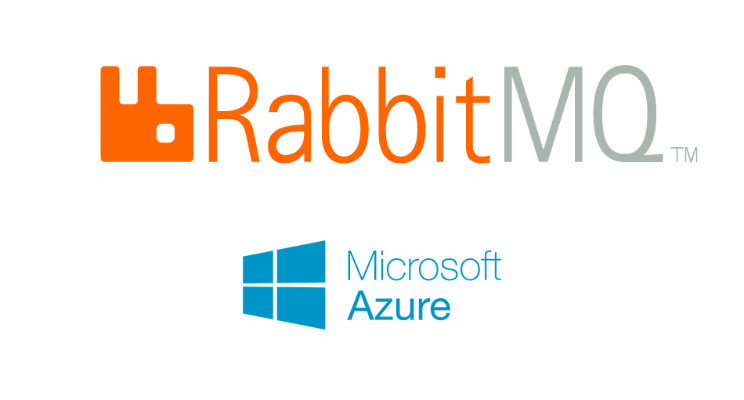

# devops-kubernetes-rabbitmq
|  |  |

----
This repository allows you to install RabbitMQ using both the Azure DevOps repository and pipeline on Azure Kubernetes Service, as well as GitHub actions.

----

Bu repository, Azure Kubernetes Servisi üzerinde RabbitMQ kurulumunun hem Azure DevOps repository ve pipeline, hem de GitHub actions kullanılarak kurulumunu sağlar.
